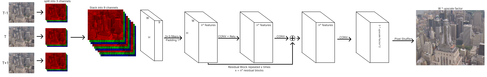

# Video Super-Resolution Using Multi-Frame CNNs (LMF-CNN)

This repository accompanies the research paper titled **"Video Super-Resolution Using Multi-Frame CNNs: A Lightweight Approach for Real-Time Enhancement"**.

Our project presents **LMF-CNN**, a lightweight multi-frame convolutional neural network model that enhances extremely low-resolution videos (e.g., 120p) up to high resolution (480p and above) in real-time. The proposed architecture is designed for deployment on consumer-grade hardware and mobile NPUs, eliminating the need for computationally expensive optical flow or motion compensation techniques.

---

## 📌 Highlights

- **No Optical Flow Required**: Frame stacking approach enables temporal learning implicitly.
- **Two-Stage Architecture**:
  - **Base Network**: Learns coarse super-resolution with stacked frames.
  - **Refinement Network**: Enhances textures and details.
- **Real-Time Feasibility**: Tested on a GTX 1650 Ti, and compatible with mobile NPUs (e.g., A17 Pro, Snapdragon 8 Gen 3).
- **Evaluation**: Achieves up to **29.63 dB PSNR** and **0.893 SSIM** with only **627K parameters**.

---

## 🧠 Architecture Overview

| Network | Description |
|---------|-------------|
| `media/network.png` | Architecture diagram of the base super-resolution model |
| `media/refinement network.png` | Refinement stage enhancing perceptual quality |
### Base Super-Resolution Network

### Refinement Network

---

## 🖼 Visual Results

| Comparison | Description |
|------------|-------------|
| `media/Group.png` | Side-by-side comparison of outputs from three model variants |
| `media/lr_output_video.mp4` & `media/hr_output_video.mp4` | Video comparison between low-resolution input and high-resolution output |

